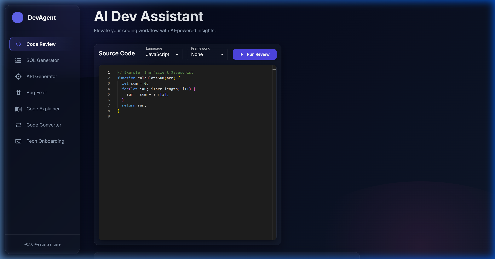
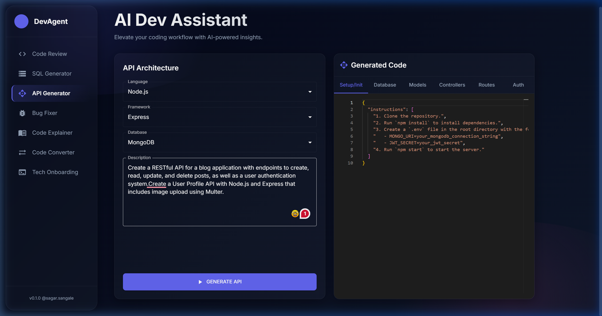
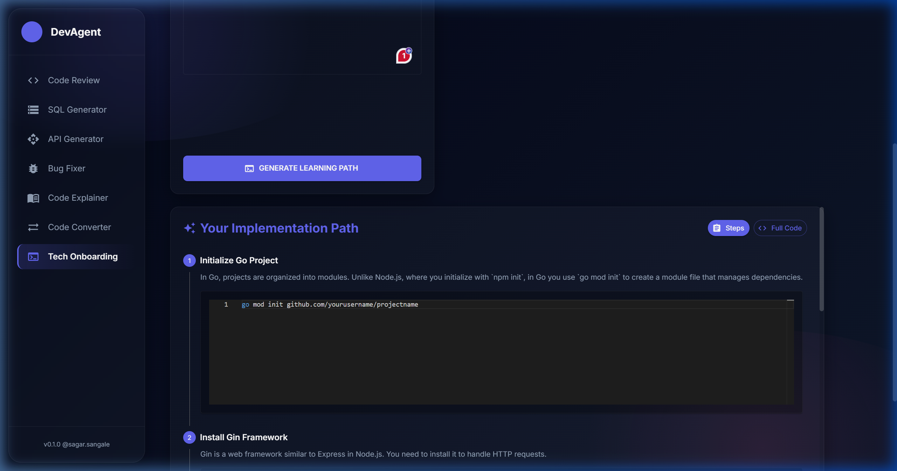
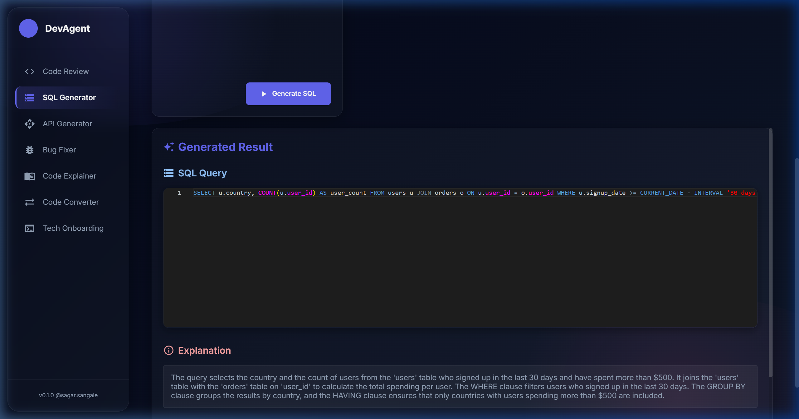
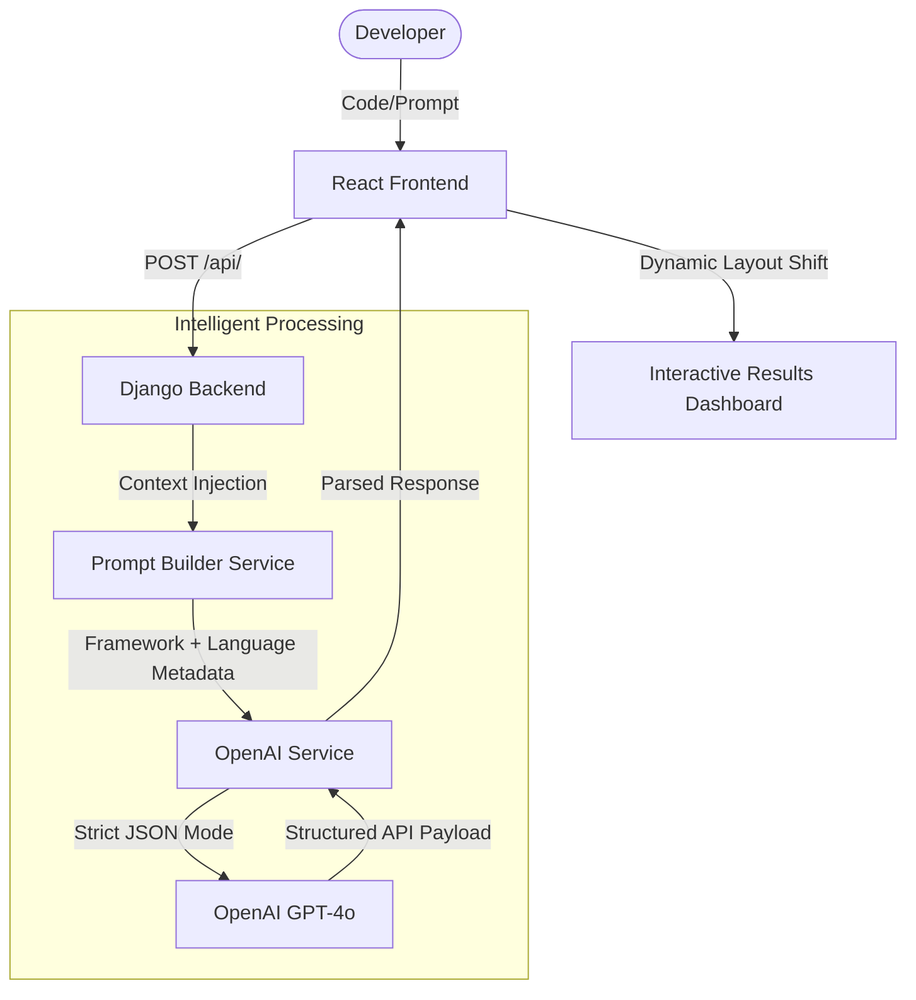

# 🚀 AI Dev Assistant

**A Premium, Full-Stack AI Ecosystem for Modern Software Engineering**

[](https://reactjs.org/)
[](https://www.djangoproject.com/)
[](https://openai.com/)
[](https://mui.com/)
[](https://www.python.org/)

---

## 🌟 Overview

The **AI Dev Assistant** is a high-performance, expert-level dashboard designed to accelerate every stage of the development lifecycle. From advanced code reviews and SQL generation to step-by-step technology onboarding, this platform bridges the gap between raw code and production-ready intelligence.

Built with a **Glassmorphism-inspired design system**, the assistant leverages **GPT-4o** but goes beyond simple chat; it implements structured prompts, framework-aware context injection, and guaranteed JSON delivery for a reliable, IDE-like experience.

---

## 🖼️ Visual Experience

| **Code Review & Analysis** | **Architecture & API Generation** |
|:---:|:---:|
|  |  |
| **Step-by-Step Tech Onboarding** | **SQL Intelligence** |
|  |  |

---

## 🚀 Key Features

-   **🧠 Framework-Aware Intelligence**: Injects deep context about your chosen tech stack (e.g., React, Django, Gin, Spring Boot) so AI advice is always relevant, not generic.
-   **🛠️ Tech Onboarding Stepper**: A unique "Bridge" module for developers switching languages. Provides a conceptual roadmap with integrated code blocks for environment setup, data models, and logic.
-   **⚡ 6/6 Dynamic Grid**: A sophisticated UI that shifts from single-column to side-by-side comparison mode automatically when results arrive.
-   **🔄 Monoaco IDE Integration**: Full VS-Code-like syntax highlighting and editing experience for both input and AI output.
-   **🏗️ Boilerplate Architect**: Generates complete project structures including Controllers, Routes, and Database configurations following industry best practices.
-   **🛡️ Production-Grade Fixes**: Identifies not just syntax errors, but strategic logical bugs and security vulnerabilities.

---

## 🏗️ System Architecture

The application follows a robust **Decoupled Architecture** optimized for high-reliability AI inference.



---

## 🛠️ Technology Stack

### **Frontend**
- **Framework**: React 19 (Hooks, Functional Components)
- **Styling**: Material UI 7+ with Custom Glassmorphism CSS Overlay
- **Editor**: @monaco-editor/react (High performance)
- **Animations**: CSS3 Keyframes & Transitions for layout shifts

### **Backend**
- **Runtime**: Python 3.x & Django 5.x
- **API Engine**: Django REST Framework (DRF)
- **AI Core**: OpenAI SDK with GPT-4o (Omni)
- **Inference Strategy**: Strictly typed JSON Object output enforcement

---

## 🏁 Getting Started

### 1. Prerequisites
- **Python 3.10+** & **Node.js 18+**
- **OpenAI API Key**

### 2. Installation
```bash
# Clone the repository
git clone https://github.com/yourusername/ai-dev-assistant.git

# Backend Setup
cd backend
python -m venv venv
source venv/bin/activate # or venv\Scripts\activate on Windows
pip install -r requirements.txt

# Frontend Setup
cd ../frontend/ai-dev-frontend
npm install
```

### 3. Environment Configuration
Create a `.env` file in the **backend** directory:
```env
OPENAI_API_KEY=your_actual_key_here
```

### 4. Running Locally
```bash
# Start Django Server (Port 8000)
python manage.py runserver

# Start React Dashboard (Port 3000)
npm start
```

---

## 📖 Extended Documentation
- 📂 [Project Overview](./docs/PROJECT_OVERVIEW.md)
- 📂 [System Architecture](./docs/ARCHITECTURE.md)
- 📂 [Technology Stack](./docs/TECHNOLOGY_STACK.md)
- 📂 [Project Structure](./docs/PROJECT_STRUCTURE.md)
- 📂 [Code Flow Guide](./docs/CODE_FLOW_GUIDE.md)
- 📂 [AI Strategy & Prompts](./docs/AI_STRATEGY.md)
- 📂 [Step-by-Step Installation](./docs/GETTING_STARTED.md)

---

**Submitted by Sagar Sangale**  
*Full-Stack Developer | AI Architect | Solution Engineer*
