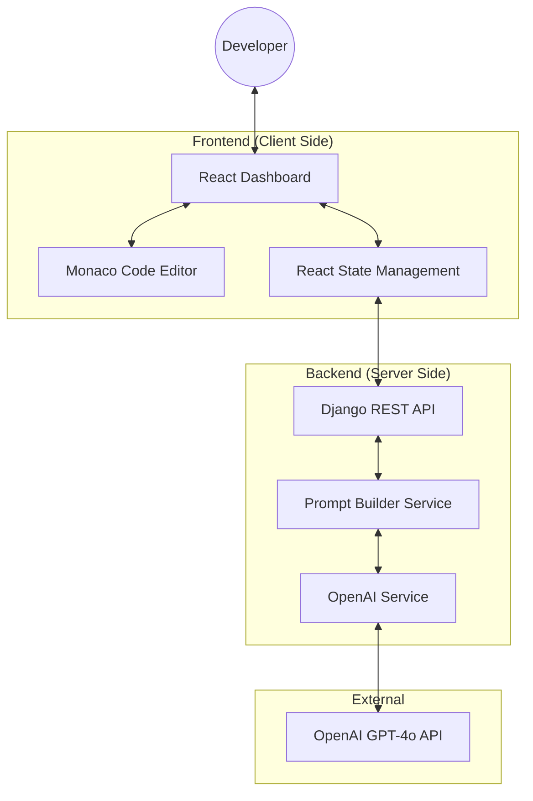

# System Architecture

## High-Level Diagram

## Architectural Design Patterns

### 1. Unified Modular Layout (Frontend)
The application uses a **Single Page Application (SPA)** architecture. The `App.js` acts as a central router that dynamically renders modules based on user selection in the Sidebar. Each module (e.g., `CodeReview.js`) is an independent, self-contained functional component.

### 2. Service-Oriented Backend
The backend is structured into specialized services:
- **Views:** Handle incoming HTTP requests and field validation.
- **Prompt Builders:** Pure logic functions that transform user input and metadata (language, framework) into structured LLM instructions.
- **AI Service:** A unified gateway that manages communication with OpenAI's API, including model parameters and security headers.

### 3. Asymmetric State Synchronization
The frontend maintains a dynamic grid system. When no result is present, the input panels occupy 100% width. Upon receiving an AI response, the state triggers a layout transition to a 50/50 split (6/6 grid), enabling side-by-side comparison.

### 4. JSON-First Communication
To ensure absolute reliability, the system bypasses standard AI "chatter." The backend forces `response_format: { type: "json_object" }`, ensuring that the 100% of the payload transmitted between the Backend and Frontend is strictly structured JSON.
